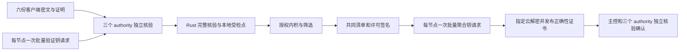

# 2026-10-04 验证与授权优化验收

已完成完整原生核验、同作业内复用受检密文点、有界线程预算、固定公开配对底数和批量函数钥请求。650 维短测中，默认两条原生线程的确定性单份完整核验约 282 ms，可选随机核验约 108 ms。三授权节点并发处理六份提交的本地验证及内积仍约 2.00 s / 0.78 s，整轮任务没有达到毫秒级。

## 实现与设计

1. `LegoVerifier.verify_linked` 在一次 Rust 调用中完成规范点/标量解码、子群检查、数值 SNARK、全部密文和注册密钥关联方程以及共享见证开口。保留原 Python 核验作为兼容路径和等价测试依据；验证关系与挑战没有改变。确定性路径逐方程检查，随机路径先受检解码，再取新鲜独立非零权重；批验失败逐方程复核。
2. 返回的本地 `VerifiedLego` 句柄保存本次已受检密文点，绑定完整上下文、客户端、CRS、范数和密文字节。授权内积在同一作业内调用受检点 MSM，仍进行参考向量范围、函数钥、配对和有界离散对数检查。句柄不能由网络输入、Python 构造或序列化获得，不跨调用缓存验证结论。
3. `verification_threads` 是每个 authority 的原生计算线程预算，默认 2，可设 1–4。Lego 的实际验证进程数为请求值与预算的较小值，每进程原生线程数为预算除以实际进程数的整数部分。默认一个进程配两条线程；若请求两个进程，分别使用一条线程。三个 authority 在同机并发时默认最多六条原生计算线程，另有 RPC、解释器等辅助线程。
4. 新 `validation_keys` 将六客户端×三 authority 的 18 个验证钥请求合为 3 个；`aggregate_keys` 将三云×三 authority 的 9 个请求合为 3 个。每份签名及密封关系保留，聚合钥和正确性证书只封给指定云。非法客户端集合或云集合在生成任何钥前拒绝，调用者不能修改参考向量。三个节点均报告能力才启用，否则使用单项接口。
5. 聚合正确性证明固定公开底数 `T=e(hash_point(ctx),G2)` 以完整上下文为键有界缓存，生成中的配对像改为等价 `T^s`。`combine` 只在同一次调用里复用已通过全量检查的 GT 点；DKG 先求系数群和，再评价每个 authority。主控和三个授权节点继续独立合并确认。



默认核验模式保持 `deterministic`。随机批验需显式选择，具有证明规格记录的额外批验误接受界限；线程和 RPC 合批不减少检查方程、授权节点数或门限。

## 650 维配对短验收

[原始公开记录](evidence/validation-authorization-20261004/benchmark.json)包含源文件摘要、实际加载原生扩展摘要、每个阶段及正确性检查。配置为 650 维、8 位，一份新微基准证明及一组六份新批次证明；同一新证明交替执行 Python 参考实现和原生实现。以下均为完整核验，包含数值证明、外层关联、共享开口、规范解码和子群检查，不是仅验证 SNARK。

| 模式与原生线程 | 同份证明参考实现 | 完整原生核验 | 配对速度比 |
| --- | ---: | ---: | ---: |
| 确定性，1 线程 | 588.99 ms | 547.01 ms | 1.08 |
| 确定性，2 线程 | 600.22 ms | 281.74 ms | 2.13 |
| 确定性，4 线程 | 615.43 ms | 156.26 ms | 3.94 |
| 随机，1 线程 | 234.49 ms | 201.59 ms | 1.16 |
| 随机，2 线程 | 235.83 ms | 107.71 ms | 2.19 |
| 随机，4 线程 | 239.74 ms | 58.81 ms | 4.08 |

单线程完整原生核验仅改善约 8–16%；两条线程的约 2.1 倍改善包含并行计算贡献，不能全部归因于 Python/Rust 调用开销。

四条原生线程、公开 BSGS 已预热的同输入配对中，密文 MSM 从 **38.65 ms 降到 0.975 ms**；完整授权内积从 **46.39 ms 降到 8.68 ms**，两个整数结果完全相同。BSGS 预计算 **10.29 ms** 单列；仍保留函数钥解码、配对与有界离散对数。

三个独立 authority 解释器同时开始各自六个公共验证作业，合计每组 18 次完整核验及授权评分：

| 模式 | 每节点 1 验证进程×2 原生线程 | 每节点 2 验证进程×1 原生线程 |
| --- | ---: | ---: |
| 确定性核验及内积 | 2,002.81 ms | 1,977.23 ms |
| 随机核验及内积 | 776.35 ms | 752.55 ms |

每组时间取三个并发 authority 中最慢的流水线 wall time；不是各作业耗时相加或 CPU 时间。四个配置共 72 次完整作业，证明、授权分数和受检点复用全部正确。相同原生线程预算下，额外验证进程只改善约 1–3%，因此当前默认一个进程更合适。

批次只预热每个公共工作进程的第一个客户端作业。其余客户端不同范数区间首次建立的 BSGS 表可能仍计入流水线；确定性组先执行，不能把确定性和随机组的全部时间差归因于验证算法。四个配置重用同一组六份新公共证明以控制输入差异，不能称为四轮全新训练实验。

冷 PK 受检加载 **2,356.37 ms**；不同线程配置的公开 VK 导入为 **74.93–78.78 ms**；三个 authority 解释器启动 **288.85 ms**。每个 authority 额外两个公共工作进程启动为 **339.82–348.24 ms**。这些初始化和首次作业预热另列于记录，没有计入温态流水线。工作进程只接收公共作业、公开 VK 和授权函数钥，不接收签名身份、DKG 私有份额或见证。

## 真实角色链路检查

[接口验收记录](evidence/validation-authorization-20261004/role-smoke.json)使用新的独立身份、端口和运行目录，启动六客户端、三 authority 和三 aggregator。为检查完整 RPC 路径，使用 50 维、8 位、单轮量化模型、1,200/400 条训练/测试样本、IID、一个本地 epoch、确定性核验、每 authority 一个进程两条原生线程，运行加密模式及匹配明文对照。

12 个角色经认证 health 报告实际导入的原生扩展摘要；18 次完整验证均使用受检点；批量接口已由能力协商选中。全部六份证明有效，批准集合及整数模型哈希与明文对照相同，准确率均为 0.1425。全部新计时字段存在，隔离角色在核对进程身份后清理完毕。该记录用于接口和结果验收，不是 650 维性能实验，也不包含鲁棒筛选效果对比。

| 加密轮阶段 | 本次 50 维接口检查 |
| --- | ---: |
| DKG | 1.247 s |
| 客户端训练、加密、证明 | 0.176 s |
| 批量验证函数钥 | 0.054 s |
| 授权核验、内积、筛选和证书 | 0.356 s |
| 批量聚合函数钥及正确性证明生成 | 0.485 s |
| 云部分解密 | 0.696 s |
| 主控检查正确性证书 | 0.017 s |
| 主控合并及三 authority 独立确认 | 5.951 s |

`validation_key_s` 和 `authorization_s` 属于 `validation_s`；`aggregate_key_s`、`partial_decryption_s`、`aggregate_verification_s` 与 `combine_and_confirmation_s` 属于 `aggregation_s`。父阶段和子阶段不能重复相加。每份作业新增 `inner_product_s`、`native_threads` 和 `checked_ciphertext_reused`，使后续实验能区分证明、授权内积与线程设置。

本次加密任务含初始化总耗时 **10.220 s**。独立确认占本次聚合阶段大部分，包含重新核验 DKG 承诺、逐坐标部分解密正确性证明及合并，尚未细分这些子成本。下一步应先在真实 650 维新服务中测量，再优化该完整检查路径；不能用未经新证明检查的旧进程轮时计算这次端到端提速。

## 验证、复现与加载

完整 Python 回归 **789 通过、12 跳过**，使用隔离的新原生扩展和 CPU Torch；其中 **51 项原生必测项目通过、零跳过**。Rust 单元测试 **9 通过**。前端 **11 项状态测试通过**、生产构建通过，Ruff 通过；更新冻结版本标识后，打包测试 **5 项通过**。[验收记录](evidence/validation-authorization-20261004/test-summary.json)说明跳过项目与加载摘要。

本机已构建 `dist/native/dgfl_native-0.2.0-cp312-cp312-win_amd64.whl`，SHA-256 为 `bc746190856f8153b891611210048995e012fb1ab52507f160ad8c792c35a613`。实际扩展 `.pyd` 摘要为 `07ece1bcc5cfb79bd9fa1f2052b22b3b7d2d984ed721e71560cdf8e6cf8e76ce`。wheel 适用 Windows x64 / CPython 3.12；其他环境从固定 Cargo.lock 构建。版本号同为 0.2.0 的旧构建可能缺少新接口，须检查 `LegoVerifier.verify_linked` 和 `VerifiedLego`。

性能与角色链路先在隔离目录验收。随后经当前控制 API 确认没有运行中实验，核对本项目十二个节点及控制进程身份，备份旧扩展、安装本次 wheel 并重启全部角色和控制服务。十二个角色的认证 health 报告加载摘要与验收构建一致；三个 authority 都报告批量授权能力。线上跨端口 Origin 检查返回 403，超过 32 KiB 的分块正文返回 413，新线程字段的后端配置校验已生效。[加载验收记录](evidence/validation-authorization-20261004/activation.json)保留公开摘要与检查结果。

复制到其他环境仍要安装匹配构建并重启全部服务；修改磁盘源码或安装扩展不会更新已加载的进程。默认核验为确定性，每节点原生预算 2；随机设置继续通过任务配置显式选择。本次升级没有运行新的正式 650 维训练任务，升级后的端到端性能需要由后续新实验记录确认。

本机温态基准复验：

```powershell
.venv\Scripts\python.exe scripts/benchmark_validation_authorization.py --runtime runtime --crs-hash 337b7b408e33a1df0de756839e5adce5be80d40fc894a24e75f7152dac39d6e4 --native-dir tmp/optimization-native --samples 3 --batch-samples 1 --threads 2 --output tmp/recheck-validation-authorization.json
```

复验仅使用已安装可信 CRS，不自动设置、启动角色或改写身份。公开记录是单样本短验收，无尾延迟或硬实时保证；单方开发可信设置和实验组合假设保持原有边界。
