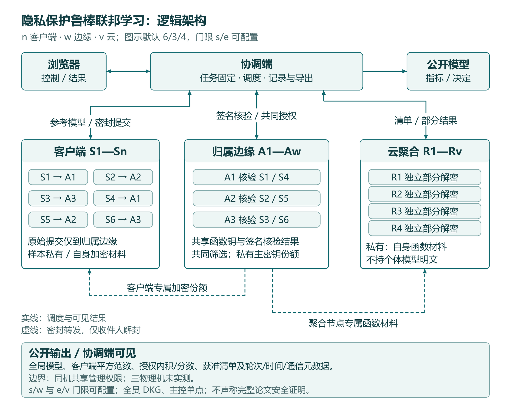
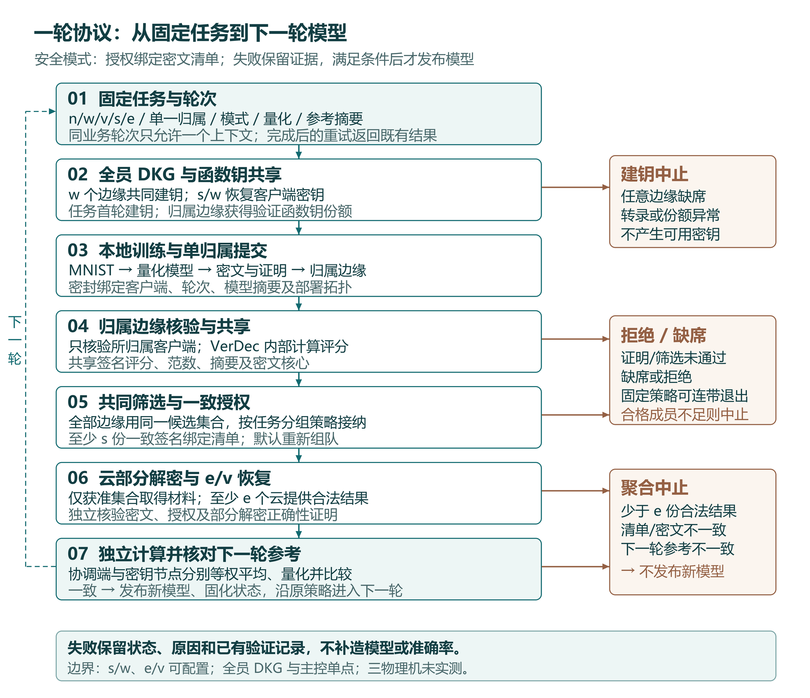
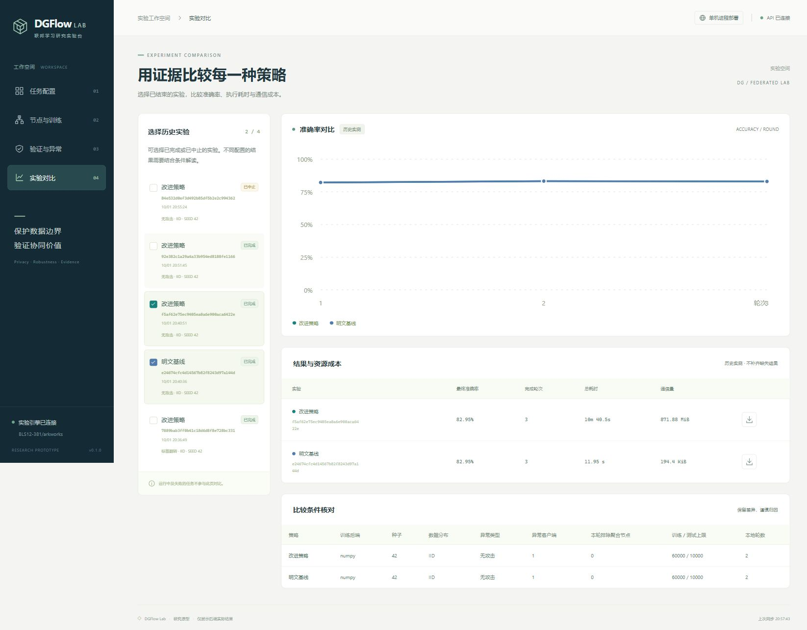

# 基于去中心化函数加密的隐私保护鲁棒联邦学习系统

作品编号：待填写竞赛平台生成编号

作品形式：软件系统　　版本：DGFlow Lab 0.1

2026-10-06 说明：系统组成及流程图已同步为可配置的单归属分层拓扑；第 7 节的三云、12 角色和固定批次数字保留为其原配置的历史实测，不能作为新四云默认或新验证分工的性能证据。

## 摘要

联邦学习将训练留在参与方本地，但上传的模型参数仍可能暴露信息。直接加密可以限制服务端读取个体参数，却也使异常更新的检查变得困难。本作品面向小规模跨机构协同训练，依据 DGFlow 论文的去中心化多授权方函数加密思想，实现一个可以启动、观测、注入异常并复现实验的研究型软件系统。

系统包含可配置的 n 个客户端、w 个边缘授权节点、v 个云聚合节点，以及本地控制与展示服务；新默认为 6/3/4。客户端将完整模型量化，默认 650 个整数，由全部边缘共同建钥提供份额。客户端生成真实配对群密文及输入证明，只交给唯一归属边缘；全部边缘共享验证函数钥份额，归属边缘完成证明核验及 VerDec，共享签名评分、范数、摘要和密文核心。全部边缘共同筛选与授权，云执行 e/v 门限聚合；边缘门限 s/w 与云门限均可配置。

作品的工程重点包括密文与发放密钥的证明绑定、固定任务策略、持久化不可变提交、节点身份隔离、可核对实验记录，以及不改变密码检查的并行调度和证明摘要传输优化。系统提供明文、仅加密、完整鲁棒和优化四种模式，以相同模型及数据配置比较正确性、攻击效果与开销。软件附有完整源码、测试、离线安装材料、部署手册及匿名支持材料。实测结果及局限在测试章节给出，不将本研究实现表述为通过商用认证的密码产品。

关键词：函数加密；分布式建钥；隐私保护；联邦学习；门限聚合；输入验证

## 1. 问题与设计目标

典型场景是多个数据持有方希望共同训练模型，却不能向中心服务器集中原始数据。这里需要同时处理三个问题：谁可以读到模型中的信息，谁能决定哪些更新进入聚合，以及部分聚合服务不可用时系统是否仍能给出正确结果。

作品采用公开 MNIST 作为可重复的数据替身，展示跨机构训练链路，不处理真实个人信息。验收目标是完整模型实际通过密码计算、未经批准的提交不能进入新模型、批准集合与密钥授权保持一致，并能用原始记录解释每次成功或中止。

本科竞赛范围内，作品将深度放在密码机制和工程闭环，选用易于解释的线性分类器。默认 650 参数模型能够让每一个参数都进入真实协议；模型维度可按池化网格 `grid` 在 650–7,850 之间配置，用于验证密码链路随规模的增长。模型规模、精度和吞吐不外推为大语言模型或生产医院系统的性能。

## 2. 系统组成与部署

| 模块 | 数量 | 职责 | 不应获得的内容 |
|---|---|---|---|
| 客户端 | n=2–100，默认6 | 本地训练、量化、加密与证明，提交到唯一归属边缘 | 其他客户端密钥和数据 |
| 边缘授权节点 | w=2–32，默认3 | 共同建钥、份额共享、归属客户端核验、共同筛选授权 | 单节点完整全局主密钥 |
| 云聚合节点 | v=2–32，默认4 | 核对许可、计算部分解密、签名结果 | 单客户端明文模型 |
| 控制服务 | 1 | 调度、转发密封消息、合并公开结果、记录实验 | 角色私有份额、安全模式个体明文 |
| 本机浏览器 | 1 | 任务、在线状态、验证结果、历史对照 | 密钥文件、本地训练样本 |

新三机示例将客户端 1/4、authority1、aggregator1/4 和主控放在 A；客户端 2/5、authority2、aggregator2 放在 B；客户端 3/6、authority3、aggregator3 放在 C。默认归属按编号轮流分配，与示例边缘分布一致，这属于工程默认。每个角色是独立进程，每台机器只持有自己的身份材料。角色通信采用内网 HTTPS 双向认证。主控网页默认只开放本机回环地址。

新默认单机部署启动 13 个角色进程，控制服务另计；原三云历史部署保持 12 个角色，普通重启不会自动扩容。进程隔离适合功能验收，不能证明物理故障域或机构权限隔离。A 主机和主控仍是可用性单点；停止整台 A 并不等于只停止一个聚合节点。

## 3. 功能设计

系统提供真实数据准备与校验、固定数据分区、任务创建和安全停止、四种运行模式、逐轮模型更新、节点健康状态、密码输入验证、异常筛选、固定批次聚合、错误留存和实验结果导出。

部署页按编号步骤卡片选择轮数、种子、IID/非IID、攻击类型和本轮不参与的聚合节点，右侧节点拓扑画布与底部操作栏给出启动前状态。界面状态由实际服务事件驱动：接收完成只意味着已收到客户端提交，随后才显示验证和聚合阶段。看板明确区分正在运行的任务与已经完成的结果。

监控页通过认证健康调用显示实际在线状态。验证页逐客户端展示证明是否通过、允许公开的相似度、批准或拒绝原因，以及因同批次成员失败而连带退出的客户端。对照页展示准确率、轮时与应用层字节数，能够追溯运行编号和配置。

攻击模式包括标签翻转、完整模型方向反转、随机模型、篡改证明相关范数和客户端缺席。攻击身份只用于测试结果统计；authority 的筛选入口不读取“谁是攻击者”的真值标签。

## 4. 密码方案与实现原理

### 4.1 分布式建钥及权限

全部 w 个边缘各自生成秘密多项式和独立盲化多项式，对系数作 Pedersen 承诺，通过密封私信发放份额。接收方验证份额后，全部边缘签名确认同一公开转录。没有“先由主控生成完整主密钥再拆分”的步骤。客户端按 s/w 门限恢复自己的密钥行，并验证与公开承诺一致。任务首轮建钥，后续轮沿用固定任务密钥周期。

本实现采用固定成员、遇异常中止的 DKG 流程。边缘 s（2–w）和云 e（2–v）可配置，但创建新周期仍要求全部 w 个边缘参与。完整恶意网络中的一致广播、恶意参与方剔除后继续建钥等性质不在本版本声明范围内。

### 4.2 函数加密与授权内积

以加法记号表示 G1，单坐标密文为 `ct = f*s + G*x`。同一轮全部客户端使用共同 f，身份通过对应密钥行、证明和认证消息单独绑定。允许的验证函数是与本轮参考模型的内积；各节点拒绝随请求换用其他参考向量。利用配对消去掩码后，通过有界离散对数恢复整数结果。

函数加密允许获得指定函数的输出，并不意味着系统没有任何泄漏。客户端平方范数、获授权内积、批准状态及全局模型都是可见信息。作品不声称差分隐私，也不承诺阻止所有跨轮或客户端串谋推断。

### 4.3 范围与平方范数证明

客户端不能仅自报一个“正常范数”。实现将量化值转换为固定 8 位表示，用 Pedersen 承诺和 OR 知识证明约束每个位。联合表示及平方关系证明连接密文里的数值、数值承诺、实际发放密钥承诺和平方承诺，最后检查平方承诺之和对应公开平方范数。

证明绑定任务、轮次、密钥周期、客户端、模型摘要和编码参数。修改范数、密文、响应或上下文会触发验证失败。证明仍不能判断训练数据真实、标签正确或模型没有后门。采用的具体组合及方程级审阅见 `docs/protocol/proof-construction.md`；外部密码学审查和完整组合安全证明尚未完成。

### 4.4 筛选、固定批次与门限聚合

鲁棒模式用获准内积和范数计算余弦分数。确定性一维二均值只有在簇中心明显分离、低簇中心足够低时才排除低簇，避免在全体正常时机械剔除一半参与者。中心差阈值 0.45、低中心阈值 0.25 在配置前固定，未根据测试结果逐种子调整。

新任务默认重新组队：至少两名合格幸存成员共同聚合并保留奇数人数。可选择历史固定二人批次策略，某人缺席或被拒会使其伙伴退出，奇数末位不参与聚合。分组策略在任务创建时固定；报告分别记录直接拒绝及伙伴连带损失。

唯一归属边缘核验客户端原始证明与授权内积，签名共享结果及密文核心；其他边缘核对归属、签名和任务上下文，使用同一全局候选集合共同筛选，并独立签发同一清单。云验证至少 s 个一致边缘签名及密文摘要，再产生部分解密。私有聚合钥附带签名配对像证明，其承诺常数由确认的 DKG 转录固定，证书随云部分结果公开。主控和全部边缘独立核验证明及实际 E，从批准密文重算 D，至少 e 个不同云的正确材料才能恢复整数和。它们分别计算下一轮模型并核对摘要。错误部分结果会被拒绝；自动选择诚实子集和完整拜占庭容错尚未实现。

### 4.5 数值边界

| 项目 | 约定或界限 |
|---|---|
| 模型结构 | `grid²×10` 权重及 10 偏置；默认 `grid=8` 为 **650** 坐标，可选至 `grid=28` 为 **7,850** 坐标 |
| 预处理 | MNIST 28×28 灰度图按 `grid×grid` 自适应平均池化，归一化至 [0,1] |
| 本地训练 | softmax 交叉熵、小批量 SGD，学习率 0.3，批大小 64 |
| 上传内容 | 完整本地模型；不混用梯度或差分 |
| 定点编码 | scale=128，bits=8，整数 [-128,127]，半整数向偶数舍入 |
| 范数平方上界 | `d×128²`（d=650 时 10,649,600；d=7,850 时 128,614,400） |
| n 客户端坐标和 | [-128n,127n]；n=6 时 [-768,762] |
| 聚合权重 | 获准客户端等权平均 |

浮点超界先按公开规则剪裁，再量化。证明覆盖最终上传整数，不能反推浮点训练过程。聚合在整数域精确恢复，之后才做平均和下一轮量化。明文基线使用相同定点处理，以区分密码错误与量化误差。

## 5. 通信、状态与软件流程

客户端、authority 和 aggregator 使用 HTTPS 双向证书认证；角色消息再使用 Ed25519 签名、X25519/HKDF 和 AES-GCM 密封。中转者可路由份额，却无法打开发给其他角色的份额。禁止 pickle 网络反序列化，外来群元素须检查编码和子群。

程序采用原子文件替换和节点内串行锁保存业务状态。RPC 请求 ID 用于原请求重试；业务唯一键用于限制每个客户端在同一任务轮次只能产生一份提交。更换 epoch 或请求 ID 无法绕过业务约束。任务模式、量化规格、成员和批次在登记后固定，已登记加密任务不能被请求降级为明文。

若主控或节点在秘密状态尚未完成时中断，本版保留历史并要求创建新任务，不假装能够从不完整 DKG 状态恢复。对角色调用采用有限重试；实际失联客户端按缺席处理。健康探测不占用耗时密码工作锁，也不无限累积心跳缓存文件。

新任务登记和首轮参考由可信本机实验管理员发起。主控不作为互联网上的多租户服务开放，当前代码未实现跨机构审批、统一身份登录和任意恶意管理员的任务授权隔离。

## 6. 工程改进与贡献划分

| 来源 | 内容 | 本作品处理 |
|---|---|---|
| DGFlow 论文 | 去中心化函数加密、验证内积、鲁棒聚合总体路线 | 按公式重建并记录实现差异，不宣称论文算法原创 |
| 公开密码文献 | Pedersen 承诺、秘密分享、表示及乘法关系、Fiat–Shamir | 补齐具体可实现的输入证明关系，给出边界与测试 |
| arkworks 等开源库 | 群与配对、HTTP/TLS、数组、前端框架 | 按许可使用并保留依赖声明；不冒充自行实现曲线运算 |
| 作品工程实现 | 密钥行绑定、固定授权、不可变状态、角色隔离、四模式实验 | 形成完整可运行和可追溯的软件链路 |
| 作品工程优化 | 独立节点并行、聚合侧证明摘要、公共计算缓存 | 保留相同密码步骤，以匹配配置实测收益 |

串行 dgflow 模式作为本代码实现的对照，不代表原作者系统的最优性能。optimized 模式并行发出互不依赖的角色调用；原始证明仍由归属边缘完整检查。云只接收证书绑定的摘要和必要密文，避免重复传输无须再次验证的证明正文。优化收益以本机、相同参数、相同轮次记录为准。

实现采用 BLS12-381 的原生 Windows arkworks 绑定，并补齐 GT 规范反序列化适配。默认训练为 NumPy；torch CPU 为可选适配，可选 GPU 密码计算另行检查能力协商与对应任务记录，不以显卡型号推断密码吞吐。下面原有 CPU 验收数字保留其历史配置与执行设备口径。

## 7. 测试方案与实测结果

### 7.1 可复现配置与计量

下文用 A 表示 plain 明文基线，B 表示 encrypted 仅加密聚合，C 表示 dgflow 串行鲁棒模式，D 表示 optimized 优化模式。B 仍检查密码证明，只关闭相似度筛选；C 是本作品实现的串行对照，并非原作者软件的性能记录。

正式场景清单在运行前固定：种子 42、43、44；主要小规模比较使用 1,200 个训练样本和 400 个官方测试样本。种子 42 的 A/D 连续运行三轮核对模型，C/D 性能对比只取匹配首轮；种子 43/44 使用匹配单轮。方向反转的 encrypted/optimized 对照采用三个种子；另单独执行篡改证明、非IID和标签翻转场景。

完整数据实验另列配置，避免与小规模数据结果混合。所有原始运行记录、失败和中止均保存；不挑选准确率较好的种子。控制台运行时会记录任务编号、配置、依赖版本、源码文件摘要、节点状态、数据划分摘要、阶段事件和逐轮结果。

轮时及阶段时间为墙钟秒。各客户端训练、加密和证明字段是调用耗时之和，不能与并行阶段墙钟直接相加。字节数统计实验 RPC 请求与响应的应用层序列化字节，不包含 TLS/HTTP/TCP 帧及独立界面心跳。采样 RSS 是本机相关进程的常驻内存之和，可能重复计算共享页，不等于整机独占内存。

### 7.2 冻结的实验结果

<!-- BEGIN VERIFIED RESULTS -->
实测主机为 Intel Core i7-14700HX（20 核、28 线程）、约 16 GB 内存，Windows 11。本次使用单机 12 角色进程，训练及密码运算均为 CPU。存在后台活动及进程缓存，采用固定顺序，以下为该环境的描述性测量，不是独立重复试验的置信区间。

| 种子 | A/C/D 首轮模型一致 | 首轮准确率 | C 轮时/s | D 轮时/s | C / D 应用层 MiB |
|---|---|---|---|---|---|
| 42 | 是 | 46.25% | 644.67 | 211.05 | 416.14 / 290.61 |
| 43 | 是 | 52.75% | 207.42 | 68.54 | 416.14 / 290.61 |
| 44 | 是 | 39.75% | 204.69 | 67.55 | 416.14 / 290.61 |

匹配首轮的 C 平均轮时为 352.26 秒，D 为 115.71 秒；平均轮时比 C/D 为 3.04。D 应用层字节数相对 C 的均值变化为 -30.17%。该比较保留全部匹配种子；42 的 C 仅运行一轮，因此没有用 C 单轮总时长与 D 三轮总时长比较。

种子 42 的 A/D 三轮整数模型摘要与批准集合全部相同。D 每轮准确率为 46.25%、56.00%、56.75%。

| 方向反转种子 | 模式 | 最后已发布模型准确率 | 完成轮中的攻击者获准/提交 | 完成轮中的诚实退出/人数 | 状态 |
|---|---|---|---|---|---|
| 42 | encrypted | 22.50% | 1/1 | 0/5 | completed |
| 42 | optimized | 26.75% | 0/1 | 1/5 | completed |
| 43 | encrypted | 42.25% | 1/1 | 0/5 | completed |
| 43 | optimized | 56.00% | 0/1 | 1/5 | completed |
| 44 | encrypted | 33.50% | 1/1 | 0/5 | completed |
| 44 | optimized | 34.50% | 0/1 | 1/5 | completed |

诚实退出包含固定批次连带退出，不能全部称作相似度检测误报。上述计数只覆盖已发布模型的轮次；未完成轮的验证记录单独保留，不以 0/0 推断没有拒绝或没有攻击。

方向反转 B 模式种子43运行中发生系统自动休眠，Windows 系统日志记录的 UTC 区间为 10:01:59 至 12:18:17。原始墙钟含休眠时间，未扣除或重写；该例仅用于正确性及攻击结果比较，不用于性能加速结论。事件来源见 environment-events.json。

| 单轮补充场景（种子42） | 准确率 | 获准客户端 | 直接证明失败 | 连带退出 | 状态 |
|---|---|---|---|---|---|
| 篡改公开范数 | 26.75% | client3, client4, client5, client6 | 1 | client2 | completed |
| 诚实非IID | 43.25% | client1, client2, client3, client4, client5, client6 | 0 | 无/未形成结果 | completed |
| 标签翻转 | 22.50% | client1, client2, client3, client4, client5, client6 | 0 | 无/未形成结果 | completed |

这些补充场景各只有一个种子，不支持对所有非IID、标签投毒或后门攻击的普遍防御结论。未被识别的有效证明投毒也如实保留；证明正确不等于训练行为正确。

完整 MNIST 实验使用官方 60,000 训练/10,000 测试样本，均匀分给六客户端，种子42。

| 轮次 | 全数据明文准确率 | 全数据加密准确率 | 整数模型及批准集合一致 | 加密轮时/s |
|---|---|---|---|---|
| 1 | 82.17% | 82.17% | 是 | 210.75 |
| 2 | 83.20% | 83.20% | 是 | 211.74 |
| 3 | 82.95% | 82.95% | 是 | 214.58 |

上述预声明套件共 20 个任务：completed=20，aborted=0，failed=0。逐例配置及运行编号见 evidence 下的 suite.json 和 result.json。

| 真实进程故障场景 | 实际完成轮数 | 终态 | 结果说明 |
|---|---|---|---|
| 停止一个聚合节点 | 1 | completed | 实际停止 aggregator3 后，其余两个聚合节点支持完成 1 轮，6 个客户端均获准。 |
| 停止两个聚合节点 | 0 | aborted | 实际停止 aggregator2/3 后，新任务在聚合门限预检中止，未进入建钥/训练，完成 0 轮。 |
| 停止一个客户端 | 1 | completed | 实际停止 client1 后完成 1 轮；仅 client3–6 获准，client2 因固定批次连带退出。 |

最终自动化验收：238 项通过，6 项跳过，0 项失败。主环境跳过 2 项 Windows 符号链接权限测试及 4 项缺少可选 pypdf 的测试；另在含 pypdf 的文档环境执行 5 项 PDF 元数据测试，全部通过。

正式性能运行前统一重启全部本机角色，运行中冻结协议及训练源码。随后修复证据导出的恢复与未完成轮统计，以及未返回攻击客户端的提交数口径；这些修正不改变密码计算或模型训练。原始记录内源码指纹未被覆盖，逐文件版本差异及历史计数核对见 release-provenance.json。
<!-- END VERIFIED RESULTS -->

### 7.3 正确性、异常与故障检查

自动化测试覆盖配对关系及编码、GT 子群检查、有符号边界、有界解码、份额篡改、三种两聚合节点组合、门限不足、密文/范数/证明/上下文篡改、已登记密钥绑定、任务模式固定、重复提交和持久状态、节点权限、数据分区、实际 mTLS 握手、打包路径与身份材料排除。

真实故障实验使用停止本项目聚合进程的方式验证可用性，区别于界面配置中的逻辑排除。只剩一个聚合节点时，预检查应中止且不发布模型；一个客户端缺席时，其固定伙伴也退出。实际结果、事件和对应节点状态在支持材料中逐项列明。

单元测试、真实网络实验和理论安全证明属于不同证据，不能相互替代。软件测试通过支持“指定条件下实现行为符合约定”，不支持声称“不存在所有密码漏洞”。

## 8. 展示、安装与交付

源包同时提供前端源码、已构建的本地静态文件、Python 源码、锁定依赖、测试、角色配置和 PowerShell/Bash 启动脚本。默认界面不依赖 CDN。Windows CPython 3.12 离线材料包括匹配平台的 wheel 与经过校验的 MNIST 公开数据；其他系统应按手册重新准备对应平台依赖，不能直接使用 Windows wheel。

建议现场顺序为：展示正常完成的历史证据；启动当前加密任务并说明阶段；演示篡改证明及具体拒绝原因；显示方向反转对照和诚实伙伴连带代价；真实停止一个聚合进程观察继续；显示不足门限的中止记录。复杂密码步骤需要实际时间，不用录制进度伪装成实时结果。

设计报告与支持材料不含队员、指导教师或学校信息；原论文和运行私钥不进入源包。第三方参考文献和许可归属保留原有公开信息。审批与签字页由参赛队伍按组委会模板独立填写，作品编号须替换封面和提交文件名中的待填项。

## 9. 局限及后续改进

本作品的实用边界包括输入证明的 O(d·bits) 开销、模型坐标量化、范数及内积泄漏、固定批次损失和主控可用性单点。对方向反转等明确异常的效果，不能外推为对所有自适应投毒及后门的防御。非IID场景中的低相似度可能来自真实数据差异，必须连同误拒一起报告。

本次交付及实测范围为本机完整版本，三机部署由使用者按随附手册实施，当前不报告三机实测性能。缺少外部密码学审查时，不给完整组合安全认证。后续可在现场三机环境完成验收，并进行独立密码审阅和更广的攻击覆盖，再考虑更高维模型和更短证明。

## 10. 结论

作品把去中心化函数加密、输入证明、固定授权和鲁棒联邦训练连接为一个可操作的软件原型。系统能够用具体事件和原始结果解释“谁提交、谁验证、谁获准、为何中止、最终模型如何得到”，并用统一基线核对密码正确性与工程优化。成果的价值在于可运行、可检查和可复现；其适用范围和未完成验证亦明确保留。

## 参考资料

1. DGFlow: Privacy-Preserving and Robust Cross-Silo Federated Learning in Decentralized Cloud-Edge，项目所获论文，重点第 IV–VI 节。作品不随包再分发论文。
2. Pedersen, Non-Interactive and Information-Theoretic Secure Verifiable Secret Sharing, CRYPTO 1991。https://cgi.di.uoa.gr/~aggelos/crypto/page8/assets/Pedersen-VSS.PDF
3. Celi, Levin, Rowell, CDLS: Proving Knowledge of Committed Discrete Logarithms with Soundness, AfricaCrypt 2024。https://eprint.iacr.org/2023/1595.pdf
4. Ethereum, py-arkworks-bls12381，实际使用版本 0.5.0。https://github.com/ethereum/py-arkworks-bls12381
5. MNIST 数据来源及校验见项目 data metadata 与 `training/data.py`，公开托管源：https://ossci-datasets.s3.amazonaws.com/mnist/
6. FastAPI 与 HTTPX 官方文档。https://fastapi.tiangolo.com/　https://www.python-httpx.org/advanced/ssl/
